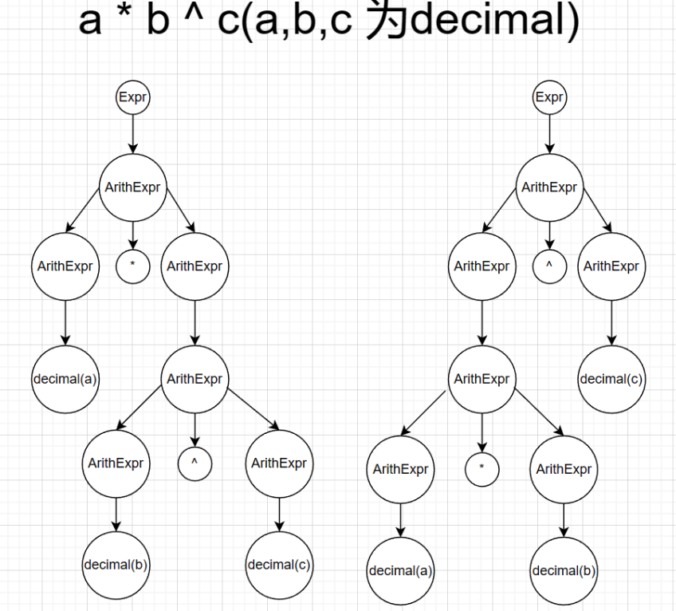
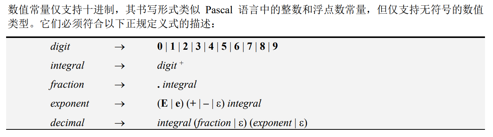
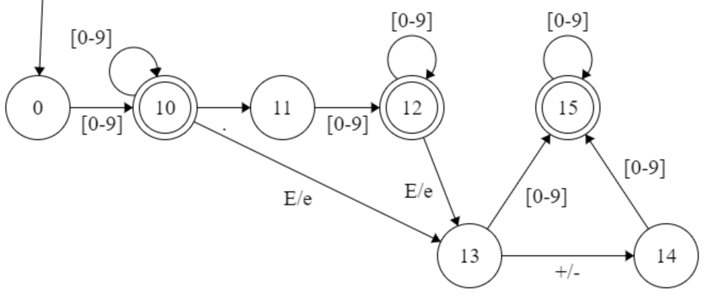
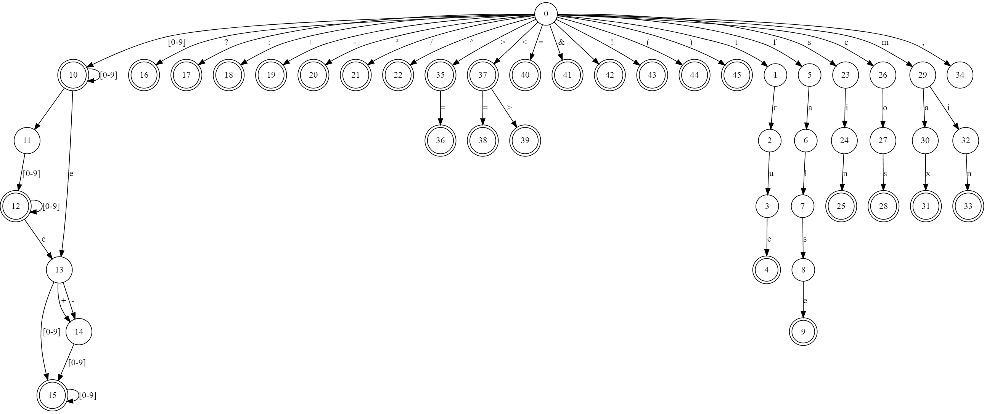
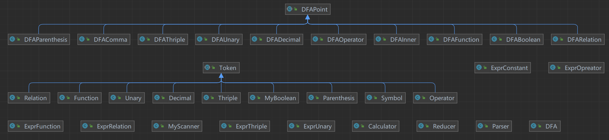

[toc]

# SYSU LAB 2 基于表达式的计算器 EXPR-Eval

> 你可以从下面找到实验所需资源

- [LAB 2 基于表达式的计算器*EXPR-Eval*](https://rtsgsysu.github.io/dcs290/2023Spring/files/lab/lab2/lab_2.pdf)
- [LAB 2 实验软装置](https://rtsgsysu.github.io/dcs290/2023Spring/files/lab/lab2/LabInstrument02-ExprEval.zip)
- [LAB 2 评分标准](https://rtsgsysu.github.io/dcs290/2023Spring/files/lab/lab2/Lab2_MarkingForm.pdf)

### 个人信息

- 姓名：任铭
- 学号：20337231
- 班级：计科2班

### 实验环境

#### 编程环境

> 本实验使用Java进行编写，编译时使用的JDK版本为1.8

#### 开发工具

>IntelliJ IDEA 2022.3.2
>
>TIPS：执行时请在Project Structure->Libraries中添加bin目录

#### 执行环境

> Windows可以直接执行buildrun.bat文件进行使用，Linux环境请自行编写`.sh`或者在自主兼容后在目录下使用`./buildrun.bat`使用

### 实验准备

#### 语法的二义性

> `EXPR-Eval`的表达式具有二义性

在不设置优先级的情况下，a*b^c就具有二义性



> 产生语法二义性的原因就是在decimal间没有定义结合的优先级，这样就会导致生成不同的两颗语法树，也就是所谓的语法二义性

为了消除语法的二义性，运算符间定义了优先级和结合的性质：

```java
// 建优先级表.(具体分级原因在后面会提到)
static {
        priorityIdMap = new HashMap <String, Integer>();
        priorityIdMap.put("(", 2);
        priorityIdMap.put(")", 3);
        priorityIdMap.put("sin", 4);
        priorityIdMap.put("cos", 4);
        priorityIdMap.put("max", 4);
        priorityIdMap.put("min", 4);
        priorityIdMap.put("--", 5);
        priorityIdMap.put("^", 6);
        priorityIdMap.put("*", 7);
        priorityIdMap.put("/", 7);
        priorityIdMap.put("+", 8);
        priorityIdMap.put("-", 8);
        priorityIdMap.put("<", 9);
        priorityIdMap.put("<=", 9);
        priorityIdMap.put(">",9);
        priorityIdMap.put(">=", 9);
        priorityIdMap.put("=", 9);
        priorityIdMap.put("<>", 9);
        priorityIdMap.put("!", 10);
        priorityIdMap.put("&", 11);
        priorityIdMap.put("|", 12);
        priorityIdMap.put("?", 13);
        priorityIdMap.put(":", 14);
        priorityIdMap.put(",", 15);
        priorityIdMap.put("$", 16);
    }
```

#### 词法分析设计与实现

##### 有限自动机

在`EXPR-EVAL`中，输入表达式支持布尔类型常量、数值类型常量（其中包括科学记数法）、各种算术运算、关系运算、逻辑运算、以及预定义函数等，在实现词法分析器前，需要根据支持的表达式语言的词法规则，绘制识别其中所有合法单词的有限自动机（状态转换图）。

> 为了更好的说明转移情况，采用数值常量进行说明



> 根据BNF，得到如下DFA。



> 在此基础上，可以得到整个`EXPR-EVAL`中合法单词的有限自动机：



##### 状态转移

> 状态转移流程如下

1. 在表达式的末尾加上$（终结符）；
2. 回到DFA的起点；
3. 获取表达式当前状态的下一个待匹配字符并且在DFA上转移：

   - 存在：转移到下一个状态；
   - 不存在：抛出异常；
4. 重复2：

   - 若lookahead == $ || 新的转移状态不存在字符为lookahead的转移边 跳出循环
   
5. 重复上述步骤234，直到待匹配的字符为$。

#### 算符优先关系定义

> 本次实验采用 **OPP** 作为语法分析技术，因此通过构造优先级表来消除语法二义性

由于在进行规约的时候，布尔常量和数值常量的优先级是最高的，将布尔常量和数值常量的优先级定义为0。

那么，构造的算符优先表如下，其中：

- 0表示shift
- 1表示reduce
- 2表示accept
- -1表示缺少操作符
- -2表示缺少运算量
- -3表示缺少左括号
- -4表示缺少右括号
- -5表示三元运算符错误
- -6表示函数使用错误


> 优先级表的设计理念，你可以在`算符优先表.xlsx`中看到完整表

- 优先级高的运算符遇到优先级低的运算符，一般进行shift操作；反之，一般进行reduce操作。

- 如果操作符是右结合的，例如 ^，那么在 ^ 遇到 ^ 的时候，需要进行shift操作；

  如果操作符是左结合的，例如 +，那么在 + 遇到 + 的时候，需要进行reduce操作。

- 数值和布尔常量的优先级最高，而终结符dollar的优先级最低。

- 在遇到一些不可能出现的情况下，抛出错误，例如布尔常量的右边紧跟着左括号。

- 由于在scanner阶段，将一元 “-” 和二元 “-” 定义为两种不同的符号，因此不需要在优先表中做敏感处理。我们定义一元取负操作的优先级高于二元减法。

- 三元运算符的优先级非常低：

  "?" 在遇见所有符号都需要进行shift操作，需要找到一个 “:”，除非是右括号或者终结符，会抛出错误；

  ":" 在遇见大多数符号都同样也需要shift，除非是冒号、逗号、右括号或者终结符，需要reduce。

- 逗号的优先级是最低的，和终结符同一个量级。

- 同样优先级的算符可以归为一类，如function、relation、加减、乘除等。

- 函数只能遇见左括号，遇见其他操作符都应该抛出错误。

#### 语法分析与语义处理的设计与实现

##### OPP核心控制部分

> 关于OPP的运作，需要：
>
> - 栈：存放当前已经读取但未处理的token
> - 输入队列：存放未读取的token
> - 算符优先关系表：每次操作需要取出栈顶的元素和输入队列首的元素，根据算符优先关系表，进行相应操作。

```bash
// 创建一个空栈
stack <- empty
// 创建一个input队列，读取token
input <- tokens list of expression
// 栈顶放置终结符
stack.push("$");

while (true):
	top <- stack.top()
    lookahead <- input[0]
    // 取栈顶元素和队头元素
    switch table[top][lookahead]:
		case shift:
			shift();
			break;
		case reduce:
			reduce();
			break;
		case accept:
			accept();
            return;
		case exception:
			throw exception;
	endswitch
endwhile

function shift():
	stack.push(input[0]);
	input.erase(0);
end

function reduce():
	while (table[stack.top()][input[0]] == reduce):
		result <- calcator(stack);
        stack.pop();
		stack.push(result);
	endwhile
end

function accept():
	result <- stack.top() == "$" ? 
```

##### 栈的设计

理论意义上，对于 OPP 算法来说，stack中只应该存在terminal元素。terminal元素表现为表达式在scanner中的输出结果，是输入表达式中最原始的元素。在进行规约操作的时候，举一个简单的例子：

```
expr -> E
E -> terminal
```

那么，对于一个terminal，在一次规约后，会规约成为non-terminal的E。也就是说，non-terminal是作为一种中间产物的形式存在。在EXPREVAL中，non-terminal表现为中间计算结果，也就是说，non-terminal表现为计算产生的布尔常量和数值常量，作为计算结果。在 OPP 算法中，non-terminal是没有实际意义的，因此在对栈做任何操作的时候，我们考虑的对象仅仅是terminal，non-terminal是为了简化计算部分而存在的。换言之，在stack.top()操作中，实际上是取出栈顶的第一个terminal元素，而non-terminal将会直接忽略。

这样定义的好处在于，可以直接规定每个操作符的行为。例如，当需要规约 “+” 的时候，我们只需要取出 “+” 的上下各一个元素，进行计算即可。这样可以大幅度地减少算法的复杂度。

##### 计算部分

我们针对栈顶元素的不同类型，制定了不同的动作。我们将栈顶的元素记为output，针对其类型，产生的动作、返回值和异常处理如下：

其中，异常处理包括语法错误和语义错误。

| output的类型              | 动作                                                         | 返回值                                                       | 异常处理                                                     |
| :------------------------ | :----------------------------------------------------------- | ------------------------------------------------------------ | ------------------------------------------------------------ |
| decimal或者boolean        | 无                                                           | 该元素的一个non-terminal副本                                 | 无                                                           |
| operator（加减乘除幂）    | 取出output在栈顶上方和下方的一个non-terminal元素             | 取出的两个元素的操作符相应的运算结果的non-terminal副本       | output上方或者下方没有元素，则缺少运算量；如果两个元素不为decimal，则为类型不匹配的语义错误 |
| unary（取负或者取非）     | 取出output上方的一个non-terminal元素                         | 该元素取负或者取非                                           | 若上方没有元素，则缺少运算量；如果取负的上方不为decimal，或者取非的上方部位boolean，则为类型不匹配的语义错误 |
| relation（关系运算符）    | 取出output在栈顶上方和下方的一个non-terminal元素             | 取出的两个元素的操作符相应的运算结果的non-terminal副本       | output上方或者下方没有元素，则缺少运算量；若为比较运算符，如果两个元素不为decimal，则为类型不匹配的语义错误；若为布尔运算符，如果两个元素不为boolean，则为类型不匹配的语义错误 |
| parenthesis（且为右括号） | 找到 ) 下面的第一个 (，提取中括号之间的所有元素，记为args。若 ( 的下方元素为空或者不为函数，则进行常量操作；否则进行函数操作。 | 常量操作无动作，函数操作则对args做相应的函数运算             | 若常量运算的args数量大于1，返回缺少运算符；若常量运算的args为空或者不为non-terminal，返回缺少运算量；若函数是一元运算，则判断args的方法，否则同上述处理；若函数是多元运算，必须保证为args为decimal和逗号相间隔的形式 |
| thriple（且为: ）         | 找到output下方的第一个?，取出 ? 前的元素，记为A；取出 ? 后的元素，记为B；取出 : 后的元素，记为C | 如果A为真，返回B的non-terminal副本，否则返回C的non-terminal副本 | 如果没有？，返回三元运算符错误；如果？和：之间的元素数量不是1，返回缺少运算符；如果A、B或者C缺少或者不为non-terminal，返回缺少运算量；如果A不是boolean，返回类型不匹配的语义错误 |
| 其他                      | 无                                                           | 无                                                           | 缺少操作符                                                   |

这个部分体现了token的分类中的分类方式的原因：

- function的分类中记录了额外的信息：是否为一元运算符；
- relation的分类中记录了额外的信息：是否为布尔运算符；

### diagram

> src项目diagram如下



**整个语法解析部分分为三个部分**

> token：token作为所有单词的基类存在，保存基本的信息，而其他分类的token为Token的继承类，记录了额外的信息和动作。

> scanner：scanner的工作需要一个有限状态自动机，DFA为静态设计，包含了46个点的状态。其中，每个状态是一个DFAPoint的继承类，非终结状态是DAFInner的实例化，而终结状态根据活前缀的类别不同，分为各种具体的DFAPoint类。

>parser：Calcator是整个工程的入口。Parser负责解析该表达式，如果产生了规约，则将规约的内容交给Reducer。Reducer作为一个工厂，产生了不同子表达式计算的商品，用于计算具体的表达式。

### 测试报告

#### 简单测试


#### 标准测试

标准测试中包含对计算器大部分功能的基本检测，通过该测试后，`EXPR-Eval`能够进行基本的工作。


### 心得体会	

- 本次实验难点在于优先级关系表的构建，scanner的处理，以及parser的规约。
- 对我而言，项目难度适中但代码量较大。比较难办的是dfa的设计以及部分异常的处理，通过查阅相关资料以及对样例的模拟确认了大部分异常。例如：

- 扫描到： ⚫3.e3 + 1 ⚫ 4 + 10.E+5 + 1 ⚫ 3.3e3.3 + 1 ⚫ 1 + 3.3E.3 + 2 ⚫ 1 + 3.3E−(3 + 2) ⚫ min(4., 7) ⚫ 12.3Emax(4, 5, 6) 会抛出 IllegalDecimalException 异常
- 扫描到：⚫5 / v4 + 1 ⚫ 4 + mix(5, 2) + 1 会抛出 IllegalIdentifierException 异常

...

- 除了两组自带测试样例，还测试了其它一些表达式，能够符合预期
